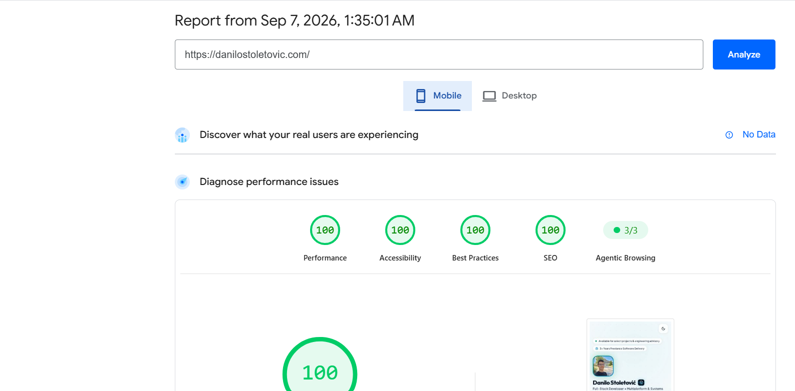
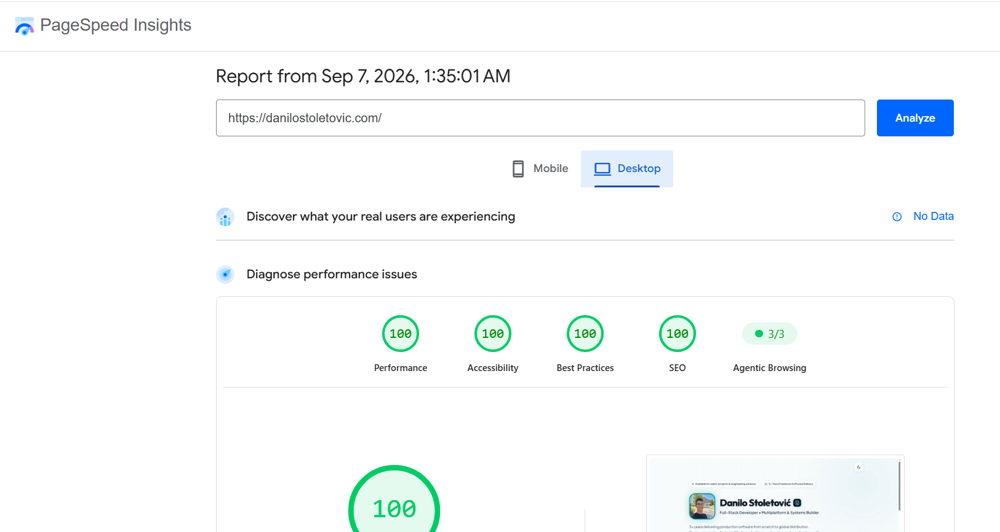

# Danilo Stoletović — Personal Portfolio

[](LICENSE)
[](https://pagespeed.web.dev/)
[](index.html)
[](index.html)
[](style.css)

> **Official portfolio and digital profile of Danilo Stoletović** — Full-Stack Developer • Multiplatform & Systems Builder. Engineered with zero JavaScript bloat, pure semantic HTML5, modern CSS design tokens, and optimized for instant TTFB, 100/100 Core Web Vitals, and autonomous AI agents.

🌐 **Live Website**: [danilostoletovic.com](https://danilostoletovic.com/)

---

## Table of Contents

- [Overview](#overview)
- [Architecture & Performance Highlights](#architecture--performance-highlights)
- [Design System & Theming](#design-system--theming)
- [AI Agent & Machine Readability](#ai-agent--machine-readability)
- [Repository Structure](#repository-structure)
- [Local Development](#local-development)
- [Deployment](#deployment)
- [Contact](#contact)
- [License](#license)

---

## Overview

This repository houses the source code for [danilostoletovic.com](https://danilostoletovic.com). The site serves as a central hub showcasing 3+ years of production software delivery spanning:
- **Mobile & Multiplatform**: Android Native (`Kotlin` / `Jetpack Compose`), `Flutter` / `Dart`, Google Play Console store publishing.
- **Desktop & Systems**: Windows Desktop (`WinUI` / `C#` / `Flutter`), Microsoft Store publishing, Linux (`systemd`), Raspberry Pi & edge devices.
- **Modern Web & Backend**: Zero-JS static architectures, modern `JavaScript` (ES6+), `React`, `Node.js`, `Python`, Programmatic SEO.
- **Edge Infrastructure**: `Cloudflare` Pages, Workers & DNS, `Vercel` Edge networks, `Docker`, and GitHub Actions CI/CD.

---

## Architecture & Performance Highlights

- **0 KB Client-Side JavaScript**: No heavy runtimes, virtual DOM overhead, bundle fragmentation, or client-side hydration delays.
- **100/100 Core Web Vitals**: Instant Largest Contentful Paint (LCP), 0ms Interaction to Next Paint (INP), and zero Cumulative Layout Shift (CLS).
- **Sub-50ms Global TTFB**: Static assets served directly from global edge CDNs.
- **Accessible & Semantic HTML5**: Full ARIA Landmark roles, screen-reader optimized heading hierarchy, and vector SVG inline assets.
- **Zero Third-Party Trackers**: Complete privacy compliance with no tracking scripts, cookies, or external surveillance widgets.

### PageSpeed Insights Audit (100/100)

| Mobile Audit (100/100) | Desktop Audit (100/100) |
|:---:|:---:|
| [](img/mobile.png) | [](img/desktop.png) |

---

## Design System & Theming

- **Modern Bento Grid Layout**: Responsive multi-card dashboard highlighting core engineering competencies, verified impact metrics, architectural philosophy, and store-published deliverables.
- **Hero & Identity Lockup**: Crisp 140px portrait photograph (`img/profilePicture.avif`), `<DS>` circuit logo badge paired directly with the title, active status indicator, and quick CTA actions.
- **Design Tokens**: Structured CSS Custom Properties (`--bg-primary`, `--accent-emerald`, `--card-rim-light`, etc.) for seamless maintainability and consistent visual hierarchy.
- **CSS-Driven Dark / Light Theming**: High-contrast, accessibility-tested dark obsidian aesthetic with pure CSS theme toggle support, extending across all bento cards and footer elements.
- **Balanced Minimalist Footer**: Two-column responsive lockup featuring the official brand mark, copyright statement, and a live Core Web Vitals / 0 KB JS status badge.
- **Fluid Typography**: Responsive typography leveraging Google Fonts (`Outfit` & `Plus Jakarta Sans`) via optimized preconnect resource hints with zero cumulative layout shift.
- **Multiplatform Favicon Suite**: Vector SVG, high-DPI 96×96 PNG, Apple Touch 180×180, PWA web manifests (192×192 & 512×512), and legacy root `favicon.ico`.

---

## AI Agent & Machine Readability

The website adheres to modern machine-readability and AI retrieval standards:

| File | Purpose |
|------|---------|
| [`llms.txt`](llms.txt) | Standardized markdown index following the [llmstxt.org](https://llmstxt.org) specification for LLMs and autonomous scrapers. |
| [`AGENTS.md`](AGENTS.md) | Structured entity overview, core stack competencies, and explicit answering instructions for AI assistants. |
| [`robots.txt`](robots.txt) | Comprehensive crawler permissions granting full access to search engines and AI agents (`GPTBot`, `ClaudeBot`, `OAI-SearchBot`, etc.), linking sitemap and agent manifests. |
| [`sitemap.xml`](sitemap.xml) | Machine-readable XML sitemap listing canonical site URLs, machine endpoints, and Google image sitemap entries. |
| **JSON-LD Microdata** | Rich Schema.org structured data embedded in `index.html` (`Person`, `ProfilePage`). |

---

## Repository Structure

```text
danilostoletovic/
├── index.html          # Main semantic HTML5 portfolio document
├── style.css           # Complete vanilla CSS design system & tokens
├── img/                # Optimized media and branding assets
│   ├── desktop.png         # PageSpeed Insights 100/100 Desktop audit report
│   ├── mobile.png          # PageSpeed Insights 100/100 Mobile audit report
│   ├── profilePicture.avif # High-efficiency AVIF portrait
│   ├── logo.avif           # Vector-derived DS circuit brand mark
│   └── favicon/            # Multiplatform favicons & webmanifest
│       ├── apple-touch-icon.png
│       ├── favicon-96x96.png
│       ├── favicon.ico
│       ├── favicon.svg
│       ├── site.webmanifest
│       ├── web-app-manifest-192x192.png
│       └── web-app-manifest-512x512.png
├── favicon.ico         # Root fallback favicon for legacy clients
├── llms.txt            # llmstxt.org specification for LLMs and scrapers
├── AGENTS.md           # Instructions and structured context for AI agents
├── robots.txt          # Crawler directives & sitemap references
├── sitemap.xml         # Machine-readable XML sitemap with image metadata
├── LICENSE             # MIT License
└── README.md           # Repository documentation
```

---

## Local Development

Because this site relies entirely on standard web technologies with **zero build step and zero dependencies**, no `npm install` or node runtime is required.

### Quick Start

Clone the repository and serve the files using any static local web server:

```bash
# Clone the repository
git clone https://github.com/danilostoletovic/danilostoletovic.git
cd danilostoletovic

# Option 1: Python 3 built-in HTTP server
python -m http.server 8000

# Option 2: Node.js (npx serve)
npx serve .

# Option 3: VS Code Live Server extension
# Right click `index.html` -> "Open with Live Server"
```

Open `http://localhost:8000` in your web browser.

---

## Deployment

Deployable with zero configuration to any modern edge static hosting platform:

- **Cloudflare Pages**: Connect GitHub repository, set build command to empty, build directory to `./`.
- **Vercel**: Import repository as a static site.
- **GitHub Pages**: Go to Settings -> Pages -> Deploy from a branch (`main` / `root`).

---

## Contact

- **Name**: Danilo Stoletović
- **Email**: [contact@danilostoletovic.com](mailto:contact@danilostoletovic.com)
- **Website**: [danilostoletovic.com](https://danilostoletovic.com/)
- **GitHub**: [@danilostoletovic](https://github.com/danilostoletovic)
- **LinkedIn**: [linkedin.com/in/danilostoletovic](https://linkedin.com/in/danilostoletovic)

---

## License

This project is licensed under the [MIT License](LICENSE) &copy; 2026 Danilo Stoletović.
