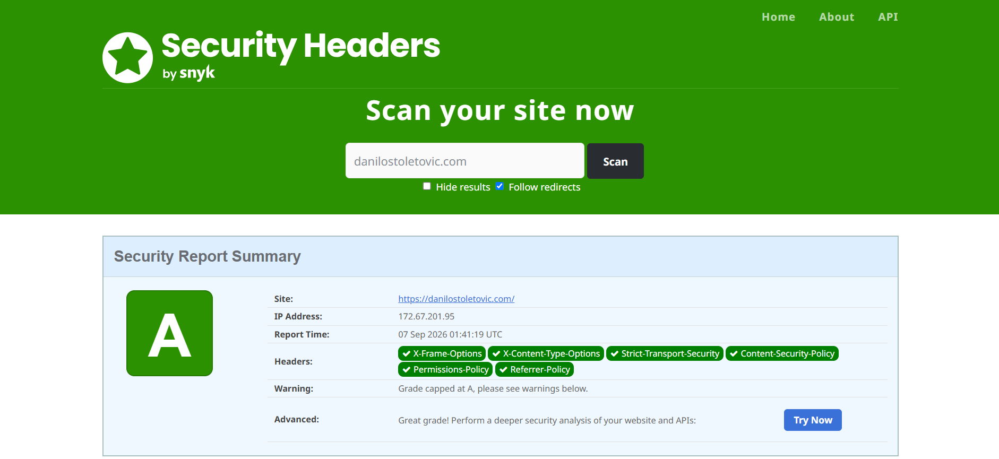
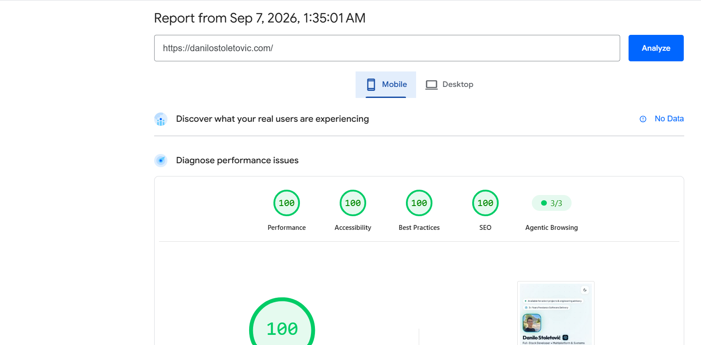
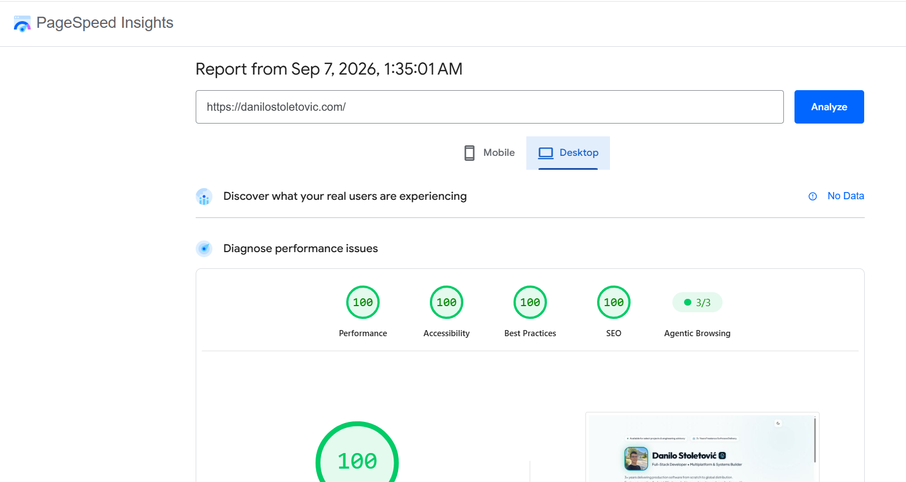

# Danilo Stoletović — Personal Portfolio

[](LICENSE)
[](https://pagespeed.web.dev/)
[](https://securityheaders.com/?q=https%3A%2F%2Fdanilostoletovic.com&followRedirects=on)
[](js/secretary.js)
[](index.html)
[](style.css)

> **Official portfolio and digital profile of Danilo Stoletović** — Full-Stack Developer • Multiplatform & Systems Builder. Engineered with zero JavaScript bloat, pure semantic HTML5, modern CSS design tokens, and optimized for instant TTFB, 100/100 Core Web Vitals, and autonomous AI agents.

🌐 **Live Website**: [danilostoletovic.com](https://danilostoletovic.com/)

---

## Table of Contents

- [Overview](#overview)
- [⚡ Performance & Security Audits](#-performance--security-audits)
- [Architecture & Performance Highlights](#architecture--performance-highlights)
- [Design System & Theming](#design-system--theming)
- [AI Agent & Machine Readability](#ai-agent--machine-readability)
- [Repository Structure](#repository-structure)
- [Local Development](#local-development)
- [Deployment](#deployment)
- [Contact](#contact)
- [License](#license)

---

## Overview

This repository houses the source code for [danilostoletovic.com](https://danilostoletovic.com). The site serves as a central hub showcasing 3+ years of production software delivery spanning:
- **Mobile & Multiplatform**: Android Native (`Kotlin` / `Jetpack Compose`), `Flutter` / `Dart`, Google Play Console store publishing.
- **Desktop & Systems**: Windows Desktop (`WinUI` / `C#` / `Flutter`), Microsoft Store publishing, Linux (`systemd`), Raspberry Pi & edge devices.
- **Modern Web & Backend**: Zero-JS static architectures, modern `JavaScript` (ES6+), `React`, `Node.js`, `Python`, Programmatic SEO.
- **Edge Infrastructure**: `Cloudflare` Pages, Workers & DNS, `Vercel` Edge networks, `Docker`, and GitHub Actions CI/CD.

---

## ⚡ Performance & Security Audits

[](https://pagespeed.web.dev/analysis?url=https%3A%2F%2Fdanilostoletovic.com)
[](https://securityheaders.com/?q=https%3A%2F%2Fdanilostoletovic.com&followRedirects=on)
[](https://hstspreload.org/?domain=danilostoletovic.com)

The website is continuously validated against strict industry-standard web performance benchmarks, accessibility audits, and defensive HTTP security standards.

| Audit Category | Score / Grade | Verification Source | Standards & Directives |
|:---|:---:|:---|:---|
| **Performance** | `100/100` | [Google PageSpeed Insights](https://pagespeed.web.dev/analysis?url=https%3A%2F%2Fdanilostoletovic.com) | Static portfolio with a small optional Secretary script |
| **Accessibility** | `100/100` | [Google Lighthouse](https://pagespeed.web.dev/analysis?url=https%3A%2F%2Fdanilostoletovic.com) | Semantic HTML5, full ARIA roles, WCAG AAA contrast |
| **Best Practices** | `100/100` | [Google Lighthouse](https://pagespeed.web.dev/analysis?url=https%3A%2F%2Fdanilostoletovic.com) | Modern AVIF formats, HTTPS enforcement, zero deprecated APIs |
| **SEO** | `100/100` | [Google Lighthouse](https://pagespeed.web.dev/analysis?url=https%3A%2F%2Fdanilostoletovic.com) | Machine-readable metadata, Schema.org JSON-LD, XML sitemap |
| **Security Headers** | `Grade A` | [Security Headers](https://securityheaders.com/?q=https%3A%2F%2Fdanilostoletovic.com&followRedirects=on) | Strict CSP, HSTS, X-Content-Type-Options, Permissions-Policy |
| **HSTS Status** | `Preloaded` | [HSTS Preload](https://hstspreload.org/?domain=danilostoletovic.com) | Strict-Transport-Security preload directive active across all browsers |

### Security Headers Verification Report

<p align="center">
  
  <br>
  <em>SecurityHeaders.com Grade A verification report for danilostoletovic.com</em>
</p>

---

## Architecture & Performance Highlights

- **Minimal Client-Side JavaScript**: The portfolio works without JavaScript. Only the optional Secretary interface uses a small, dependency-free script.
- **100/100 Core Web Vitals**: Instant Largest Contentful Paint (LCP), 0ms Interaction to Next Paint (INP), and zero Cumulative Layout Shift (CLS).
- **Sub-50ms Global TTFB**: Static assets served directly from global edge CDNs.
- **Accessible & Semantic HTML5**: Full ARIA Landmark roles, screen-reader optimized heading hierarchy, and vector SVG inline assets.
- **Zero Third-Party Trackers**: Complete privacy compliance with no tracking scripts, cookies, or external surveillance widgets.

### PageSpeed Insights Audit (100/100)

| Mobile Audit (100/100) | Desktop Audit (100/100) |
|:---:|:---:|
| [](img/mobile.png) | [](img/desktop.png) |

---

## Design System & Theming

- **Personal workshop layout**: Warm paper, ink borders, orange accents, editorial typography, and an original inline SVG vehicle sketch.
- **Project-first content**: YOLO Smart Vehicle, Class Timetable, PromptUI, and the portfolio itself, with direct project and source links.
- **System typography**: Georgia, Arial, and Courier New; no external font requests.
- **CSS-only light / dark themes**: Follows the system preference; the keyboard-accessible checkbox reverses it for the current page.
- **Responsive and accessible**: Single-column mobile layout, skip navigation, visible focus, reduced-motion support, and semantic landmarks.
- **Shared 404 styling**: The error page uses the same stylesheet and navigation destinations.
- **CSS delivery**: The homepage embeds `style.css` and `css/secretary.css` to remove stylesheet requests from the first-render path. After editing either source, run `node scripts/inline-styles.cjs` and commit the updated `index.html`. CSS is embedded without transformation to preserve layout and no-JavaScript behavior. This trades independent stylesheet caching for a larger HTML response on the single-page portfolio. The 404 page still uses `style.min.css`; regenerate that file and bump its version when changing the shared styles.
- **Public email delivery**: The homepage contact link is wrapped in Cloudflare's `email_off` comments so the already-public address stays usable without an email-decoding script. Check the deployed response after release to confirm Cloudflare preserves the exclusion.

---
## AI Agent & Machine Readability

The website adheres to modern machine-readability and AI retrieval standards:

| File | Purpose |
|------|---------|
| [`.well-known/ai-catalog.json`](.well-known/ai-catalog.json) | Static [AI Catalog 1.0](https://ai-catalog.io/spec/) manifest listing public content and policy resources by media type. Discovered through the well-known URL and the homepage's `rel="ai-catalog"` link; served as `application/ai-catalog+json`. No executable agent or API is advertised. |
| [`llms.txt`](llms.txt) | Standardized markdown index following the [llmstxt.org](https://llmstxt.org) specification for LLMs and autonomous scrapers. |
| [`AGENTS.md`](AGENTS.md) | Structured entity overview, core stack competencies, and explicit answering instructions for AI assistants. |
| [`robots.txt`](robots.txt) | Comprehensive crawler permissions granting full access to search engines and AI agents (`GPTBot`, `ClaudeBot`, `OAI-SearchBot`, etc.), linking sitemap and agent manifests. |
| [`sitemap.xml`](sitemap.xml) | XML sitemap containing the canonical homepage; project fragments, external sites, alternate representations and support files are excluded. |
| **JSON-LD** | Rich Schema.org structured data embedded in `index.html` (`Person`, `WebSite`, `ProfilePage`, `Service`, `CreativeWork`, `SoftwareSourceCode`). |

---

## Repository Structure

```text
danilostoletovic/
├── index.html          # Main semantic HTML5 portfolio document
├── 404.html            # Custom zero-JS 404 error page matching dark/light design system
├── style.css           # Complete vanilla CSS design system & tokens
├── img/                # Optimized media and branding assets
│   ├── desktop.png         # PageSpeed Insights 100/100 Desktop audit report
│   ├── mobile.png          # PageSpeed Insights 100/100 Mobile audit report
│   ├── securityHeaders.png # SecurityHeaders.com Grade A audit report
│   ├── profilePicture.avif # High-efficiency AVIF portrait
│   ├── logo.avif           # Vector-derived DS circuit brand mark
│   └── favicon/            # Multiplatform favicons & webmanifest
│       ├── apple-touch-icon.png
│       ├── favicon-96x96.png
│       ├── favicon.ico
│       ├── favicon.svg
│       ├── site.webmanifest
│       ├── web-app-manifest-192x192.png
│       └── web-app-manifest-512x512.png
├── site.webmanifest    # Root Web App Manifest for PWAs & modern browser installability
├── favicon.ico         # Root fallback favicon for legacy clients
├── humans.txt          # Team, architecture, and technology credits (humanstxt.org)
├── llms.txt            # llmstxt.org specification for LLMs and scrapers
├── AGENTS.md           # Instructions and structured context for AI agents
├── robots.txt          # Crawler directives & sitemap references
├── sitemap.xml         # Machine-readable XML sitemap with image metadata
├── LICENSE             # MIT License
└── README.md           # Repository documentation
```

---

## Local Development

Case studies and service pages are maintained in `scripts/build-pages.cjs`. Run `node scripts/build-pages.cjs` to regenerate their static HTML and `sitemap.xml`. Shared additions use `css/content.css`; the original workshop theme remains in `style.css`. Update `index.md`, `llms.txt`, and the AI catalog alongside changes to public content.

`data/testimonial-samples.md` contains explicitly fictional writing samples, not client endorsements. They are not rendered on the website or included in Secretary knowledge. Search Console setup and measurement notes are in `data/design-and-search-notes.md`.

### Ask Danilo's Secretary

The portfolio contains a lightweight frontend for Danilo's virtual Secretary in
`js/secretary.js` and `css/secretary.css`. The actual service is a separate Cloudflare
Worker, maintained in the separate `Secretary` repository. Production API:
`https://secretary.danilostoletovic.com`.

The browser sends HTTPS `POST /chat` requests containing a current `message` and
an optional ordered `history` of prior `{ "role": "user" | "assistant", "content": "…" }`
messages, then reads a nonempty string from `{ "reply": "…" }`. History is
untrusted, session-only client state capped at 40 messages and
12,000 characters; the current question is sent separately and is not duplicated
in `history`. The browser never receives the OpenAI API key. No backend
credentials, database, or chat analytics are included here. Replies are rendered
as text.

The launcher initializes the dialog on first use; it does not inject default
question options into the conversation. Requests time out after 30 seconds;
errors and rate limits offer a retry and an email alternative. The rest
of the portfolio works without JavaScript or API availability.

No frontend configuration is needed for production. `_headers` permits the API
in `connect-src`; the Worker already permits the production site's origin via
CORS. For live requests from localhost or preview domains, the separate Worker
must allow that origin. Do not work around CORS with a frontend key or proxy.

The site runs directly from the project root with no build step or dependencies.

### Quick Start

Clone the repository and serve the files using any static local web server:

```bash
# Clone the repository
git clone https://github.com/danilostoletovic/danilostoletovic.git
cd danilostoletovic

# Option 1: Python 3 built-in HTTP server
python -m http.server 8000

# Option 2: Node.js (npx serve)
npx serve .

# Option 3: VS Code Live Server extension
# Right click `index.html` -> "Open with Live Server"
```

Open `http://localhost:8000` in your web browser.

---

## Deployment

### API discovery and access documentation

`/.well-known/api-catalog` is an RFC 9727 Linkset describing the existing Secretary
API, with `service-desc` and `service-doc` links to `/openapi.json` and `/api.md`.
It is a static asset; `_headers` sets `application/linkset+json` and a catalog Link
header for GET and HEAD. No health endpoint is advertised.

The homepage Pages Function adds RFC 8288 Link headers for `api-catalog`,
`service-desc`, `service-doc`, and `describedby` to HTML and negotiated Markdown
responses, including HEAD. Existing Link values are preserved. API description
and documentation links use the Secretary endpoint as their link context.

`/auth.md` documents the existing unauthenticated access model. The portfolio
does not implement agent registration, credential issuance, or OAuth, so it does
not publish fictional OAuth metadata or registration URLs. A scanner requiring
actual agent registration may still report that capability as unsupported.

These resources deploy with the existing Cloudflare Pages Git integration and
require no build step. A plain static server does not apply `_headers` or run
the homepage Function.
After deployment, POST `{"url":"https://danilostoletovic.com"}` as JSON to
`https://isitagentready.com/api/scan` and inspect
`checks.discovery.apiCatalog.status` and
`checks.discoverability.linkHeaders.status`; both should be `"pass"`.

### Cloudflare AI content signals and Markdown negotiation

`robots.txt` and the global `_headers` rule declare `search=yes, ai-input=yes, ai-train=yes`, preserving the site's open crawler policy. `AGENTS.md` explains public access boundaries. All crawlers share one wildcard group so bot-specific groups cannot shadow the policy.

`index.md` provides a maintained Markdown version of the homepage. Update it whenever homepage projects, biography, or contact details change. The HTML alternate link and `llms.txt` advertise it.

On Cloudflare Pages, `functions/_middleware.js` serves that file for homepage requests that explicitly prefer `text/markdown`. It respects Accept quality weights, defaults to HTML, supports HEAD, and preserves static asset security headers. `_routes.json` limits function execution to `/` and `/index.html`. Negotiated responses use `Vary: Accept` and `no-store` to prevent HTML/Markdown cache collisions; other static assets keep their existing caching. Homepage requests consume Pages Functions invocations.

Deploy the static project root with no build command and retain Pages Functions support. Keep `functions/` at the repository root so Pages compiles it separately; it must not be copied as public assets. Dashboard drag-and-drop uploads do not compile Pages Functions. Other static hosts and plain local file servers expose `/index.md` but do not run negotiation. No browser JavaScript or build dependencies are added.

Cloudflare's optional zone-level [Markdown for Agents](https://developers.cloudflare.com/fundamentals/reference/markdown-for-agents/) can also convert HTML, but this implementation does not require that dashboard setting. Keep any Cloudflare-managed robots policy consistent with the repository's all-yes content signals.

Verify after deployment (the first response should be Markdown, the second HTML):

```sh
curl -i -H "Accept: text/markdown" https://danilostoletovic.com/
curl -i -H "Accept: text/html" https://danilostoletovic.com/
curl -I https://danilostoletovic.com/index.md
curl https://danilostoletovic.com/robots.txt
```

The static site can also be hosted on other platforms (negotiation requires equivalent server support):

- **Cloudflare Pages**: Keep the existing Git integration; leave the build command empty and use the project root as the output directory.
- **Vercel**: Import repository as a static site.
- **GitHub Pages**: Go to Settings -> Pages -> Deploy from a branch (`main` / `root`).

---

## Contact

- **Name**: Danilo Stoletović
- **Email**: [contact@danilostoletovic.com](mailto:contact@danilostoletovic.com)
- **Website**: [danilostoletovic.com](https://danilostoletovic.com/)
- **GitHub**: [@danilostoletovic](https://github.com/danilostoletovic)
- **LinkedIn**: [linkedin.com/in/danilostoletovic](https://linkedin.com/in/danilostoletovic)

---

## License

This project is licensed under the [MIT License](LICENSE) &copy; 2026 Danilo Stoletović.

## Discoverability maintenance

The linked JSON-LD graph uses stable identities for the person, website, page, services, and projects. Keep it synchronized with visible content and `index.md`; do not add unverified credentials or project licenses. Upwork and Fiverr are owner-supplied identity links, not scraped data. `llms.txt` is the concise index and `index.md` is the full public text representation, so an additional `llms-full.txt` would duplicate maintained content.

The only canonical public page is `/`; projects have stable HTML fragments and external source links. API documentation and existing discovery catalogs remain available but are not sitemap entries. Robots exclusions are crawler guidance, not access control, and apply only to this origin (the separate Secretary Worker controls its own access policy).

Cloudflare settings cannot be changed by these static files: configure the build/output directory above, retain Functions support, and verify GET/HEAD discovery resources and Markdown negotiation after deployment. Check zone-managed robots, WAF/bot rules and caching against the intended public policy. No agent registration or OAuth service is implemented.

### Agent skills and browser tools

`/.well-known/agent-skills/index.json` follows the Agent Skills Discovery RFC v0.2.0
and links to public `read-portfolio` and `secretary-chat` skills. Each digest covers the exact UTF-8
bytes of `SKILL.md`; `.gitattributes` keeps those bytes LF-normalized. After editing
the skill, update its digest with `node scripts/update-skill-digest.cjs`.
The homepage advertises the index in HTML and HTTP Link headers; `llms.txt` also links it.

`js/webmcp.js` registers `read_portfolio_section` and `navigate_portfolio` on page
load in supported browsers. It prefers `document.modelContext` and falls back to
the older `navigator.modelContext`. Registration is aborted on pagehide and
restored on pageshow, including back/forward cache restores. Unsupported browsers
keep the ordinary site behavior. The tools use current page content, make no API
requests, and send no messages. The Secretary form remains an ordinary chat UI.
WebMCP is experimental; native browser interoperability needs testing in a browser
that implements the API. Run `node --test tests/discovery.test.cjs` for local checks.

OAuth/OIDC discovery, Protected Resource Metadata, and Auth.md registration are
not applicable to the current public access model. `/auth.md` describes it accurately.
A browser WebMCP tool is not a remote MCP transport: no MCP Server Card is published
because there is no remote MCP server to describe.

### DNS-AID publication

On 2026-09-29, the following record was published through Cloudflare DNS and
verified through Google and Cloudflare public resolvers. DNSSEC is enabled and
the registrar DS record is published. Google Public DNS returned authenticated
data (`AD: true`) for the SVCB record on 2026-09-29. During propagation, Cloudflare's
resolver still returned an older unauthenticated answer, so the readiness scanner
may temporarily report a DNSSEC warning. DNS changes are managed outside this
repository; adding a DS record to HTML or JavaScript does not enable DNSSEC.

This ServiceMode SVCB record advertises the site's HTTPS discovery entrypoint
(priority 1, port 443, Cloudflare Auto TTL currently 300 seconds):

```dns
_index._agents.danilostoletovic.com. 300 IN SVCB 1 danilostoletovic.com. alpn="h2" port=443
```

The HTTPS homepage links to the API catalog and skills index. This is a basic
organization entrypoint, not an A2A or MCP endpoint. DNS-AID leaves index schemas
and protocols outside its scope, so client compatibility must be verified. No
experimental path parameter is assigned here: the draft has no final numeric key
allocation. If a consuming implementation requires a path parameter, agree on its
numeric `keyNNNNN` mapping before publishing it; do not invent a registered key.
See the [DNS-AID draft](https://datatracker.ietf.org/doc/draft-mozleywilliams-dnsop-dnsaid/)
and [RFC 9460](https://www.rfc-editor.org/rfc/rfc9460).

Cloudflare Registrar published the following parent-zone DS record, verified
through both Google and Cloudflare public resolvers:

```dns
danilostoletovic.com. IN DS 2371 13 2 4CC099C898F437788649E7D8F9A3D56794F218AB0272FA14DC864CCBC2EACB3E
```

This is a record of the verified configuration, not an instruction to add another
DS record inside the child zone. Keep registrar DS values synchronized with the
DNS provider during any future key or provider changes. See
[Cloudflare's DNSSEC setup](https://developers.cloudflare.com/dns/dnssec/).
Once propagated, query SVCB type 64 with DNSSEC enabled through a validating
resolver; require the expected record, a successful response, and `AD: true`.
Also verify the parent DS and the zone DNSKEY. A successful DNS response without
authenticated data does not complete the DNSSEC requirement.

### Discovery audit (2026-10-06)

The existing Skills Index uses Cloudflare's discovery v0.2.0 format. Keep its
hyphenated skill names: underscores are not valid skill artifact names. The
`read-portfolio` instructions describe `portfolio_information`,
`project_information`, `services_information`, and `freelance_inquiry` as public
informational capabilities. The separate `secretary-chat` skill describes
`secretary_chat` through Ana's existing custom `POST /chat` API. Discovering a
skill does not call the API or send an inquiry. Skill artifacts and the index
use revalidation rather than immutable caching.

WebMCP remains unchanged: `read_portfolio_section` reads visible public content,
and `navigate_portfolio` scrolls to an allowlisted section. Both have explicit
object schemas with an enum and no additional properties; neither performs
network requests or writes to external systems.

Google Public DNS returned the documented DNS-AID SVCB record on 2026-10-06,
with `Status: 0` and `AD: true`. No repository-side DNS change is needed.

The current [A2A specification](https://a2a-protocol.org/latest/specification/)
uses `/.well-known/agent-card.json`; `/.well-known/agent.json` is a legacy location.
Ana's custom `{message, history}` / `{reply}` API does not implement A2A messages,
tasks, or protocol operations. A static card cannot make that endpoint A2A
compliant. Do not advertise JSONRPC, HTTP+JSON, an A2A protocol version, or a
custom A2A binding for it without implementing the corresponding protocol.
An A2A discovery recommendation must remain unsupported until a real interface
is available. OAuth discovery, protected resource metadata, remote MCP cards,
and Web Bot Auth remain intentionally absent.

Current surfaces:

- Humans: browser → portfolio → Ana UI → Secretary `/chat` → shared Ana backend.
- Browser agents: agent/browser → WebMCP → public portfolio reading/navigation tools.
- Skill discovery: agent → Skills Index → public capability descriptions.
- DNS discovery: agent → existing DNS-AID entrypoint.

Planned A2A flow (developer architecture; not implemented or published):

```text
A2A agent
  → portfolio Agent Card
  → Secretary Worker A2A endpoint
  → shared Secretary validation/rate admission
  → converseWithAna
  → existing Ana model path
```

The Secretary audit confirms adapter readiness, not protocol support. The next
implementation belongs in the Secretary Worker and calls `converseWithAna`
directly, with its lazy input reader and trusted `{ env, clientIp }` context.
Do not add a portfolio proxy to `/chat`, copy backend code, or invent an endpoint
path. Add the portfolio Agent Card only after a genuine public A2A endpoint is
implemented and tested in the Worker. Ana currently has no A2A interface,
streaming, persisted tasks, or server sessions. Internal entry-point names belong
in developer notes, not public capability metadata.

`_routes.json` invokes Functions only for `/` and `/index.html`; `.well-known`
files are static assets. The root `404.html` prevents Pages' implicit SPA
fallback for missing resources. No redirects or rewrite rules are present.
After a reviewed deployment, verify GET and HEAD for the Skills Index and both
skill artifacts, JSON/Markdown content types, digest equality, and a 404 for a
missing skill. Cloudflare zone cache overrides and WAF rules must still allow
the intended public discovery; no new dashboard setting is required here.

## Offers and testimonials

Offers use native details/summary controls: keyboard, touch, and no-JavaScript support without dependencies. Contextual Secretary links reuse the existing dialog and fall back to contact.

Testimonials are maintained directly in index.html and index.md. Publish only approved quotes and attribution; keep private records outside the repository.
